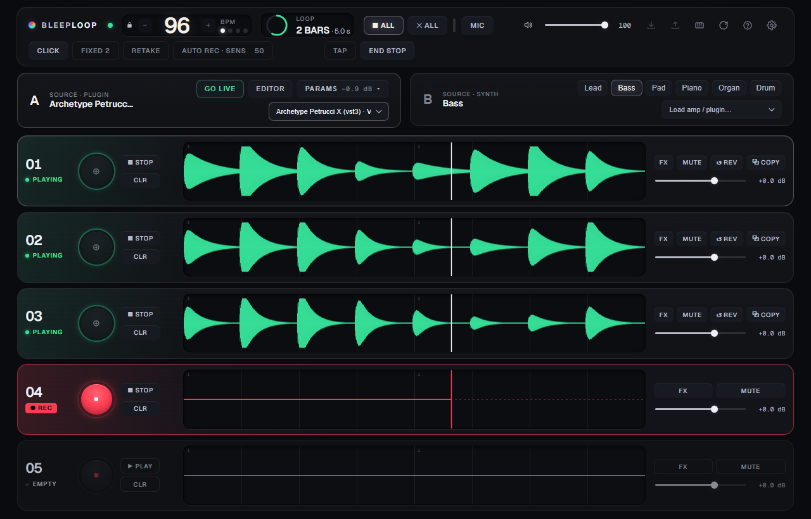

# BleepLoop

[](https://github.com/ikkeseb/bleeploop/actions/workflows/ci.yml)
[](LICENSE)
[](#getting-started)

BleepLoop is a Windows looper you play with a guitar. Load your own amp-sim plugin (CLAP or VST3),
hear it through native ASIO monitoring, and loop and overdub on five RC-505 MK II–style tracks, with
every take compensated onto the grid. Six built-in Web Audio synths and a MIDI keyboard fill the
other layers; the computer keyboard is the fallback.

**What BleepLoop is not**

- Not a DAW: no timeline or arrangement. The mix is per-track volume, mute and FX.
- Not an amp sim: bring your own plugin.
- Not a low-latency synth host: MIDI-played synths and plugins run on the WebView audio path, above
  the native monitor's latency.
- Not a web app: the browser build is a verification rig.
- Not cross-platform: Windows only, and built from source for now.

> Pre-release and Windows-only. There are no binary releases yet, so you build it from source
> (see below). The low-latency ASIO® tier is an opt-in build feature that needs Steinberg's SDK,
> see [Third-party notices](#license-and-third-party-notices).



## Features

- 5-track looper with overdub and one-level undo, per-track reverse, mute and volume, a one-bar
  record count-in and fixed-length record. The metronome is phase-locked to the loop grid, so the
  click and the loops cannot drift apart.
- AUTO REC arms a track and starts the take when you start playing, instead of the count-in.
- RETAKE keeps recording round the loop until you stop and keeps the last complete pass (the first
  track needs FIXED).
- END STOP stops playing loops at the loop end; a second press stops them at once.
- COPY duplicates a track, with its FX, volume and mute, into the first empty track.
- A later take shorter than the loop repeats (tiles) across it, so every track has the loop's exact
  length.
- Local recovery: committed loops are saved as you play and restored when you reopen, and closing
  the app with a jam in progress asks first.
- Per-track FX: filter, pitch shift, tempo-synced stutter, feedback delay and a shared reverb send.
  Each one bypasses without a click.
- Six built-in Web Audio synths, one of them a 16-voice GM drum kit.
- Two native CLAP/VST3 plugin slots with floating plugin editors; each slot reloads its last plugin at
  launch, never armed.
- Guitar or line input with native low-latency monitoring over WASAPI or ASIO. Record-latency
  compensation puts the take on the grid.
- MIDI controllers work through WebView2's native Web MIDI, and a MIDI footswitch, key or CC can be
  learned onto a looper action in Audio Settings. Without one, the computer keyboard plays notes and
  runs the transport (1-5 or the arrow keys to select a track, Space to record, Enter to play and
  stop, Backspace to undo; Help lists every key).
- Session export and import as one `.zip`: a WAV stem per track, a wet stereo master render and a
  `session.json`.

## Play it

1. Plug the guitar into your audio interface and start the app (`pnpm dev:asio`, or the built exe).
2. Load your amp-sim plugin (CLAP or VST3) into a slot and press GO LIVE. Pick the input channel in
   Audio Settings.
3. Select a track with 1–5 and press Space to record. The first take gets a one-bar count-in; come in on "1".
4. Space again closes the take; after that, Space overdubs the selected track and Enter plays or stops it.
5. Help (the ? in the command bar) lists the rest.

## Getting started

The frontend runs on its own in a browser with no native dependencies. Plugin hosting and native
audio I/O come from the Tauri shell around it.

### Web frontend only

- Node >= 22.18, pnpm 10

```bash
git clone https://github.com/ikkeseb/bleeploop.git
cd bleeploop
pnpm install
pnpm dev          # http://localhost:1420
```

### Full native app

- Everything above, plus:
- Rust (pinned via `src-tauri/rust-toolchain.toml`), MSVC Build Tools 2022, WebView2

```bash
pnpm dev:wasapi                      # full app, WASAPI, no extra SDK needed
pnpm exec tauri build --no-bundle    # standalone WASAPI exe in src-tauri/target/release/app.exe
```

### ASIO low-latency tier (optional)

Set `LIBCLANG_PATH` (cpal's `asio-sys` runs bindgen) and point `CPAL_ASIO_DIR` at your own copy of
the Steinberg ASIO SDK. The SDK is not in this repo. A binary built with it is GPLv3, see
[Third-party notices](#license-and-third-party-notices).

```bash
pnpm dev:asio     # full app, ASIO + native sample rate
```

## Commands

| Command | What it does |
|---|---|
| `pnpm dev` | Vite dev server, frontend only |
| `pnpm dev:asio` | Full app, ASIO low-latency + native sample rate |
| `pnpm dev:wasapi` | Full app, WASAPI (no ASIO SDK needed) |
| `pnpm build` | `tsc --noEmit && vite build`, which the Tauri bundle depends on |
| `pnpm build:app` | Standalone release exe with ASIO (`tauri build --no-bundle --features asio`) |
| `pnpm check` | Typecheck, oxlint, the capability-boundary check and the `verify/` guards. Also the pre-push hook |
| `pnpm verify` | Deterministic guards for the audio core's pure logic, no browser or hardware |
| `pnpm probe <name>` | One browser probe against the real app on its own Vite server; `--ci` runs every CI probe, `--list` names them |
| `pnpm verify:jam` | The golden jam. Drives the real app in a headless browser and checks the recorded grid frame by frame (~95 s, not part of `pnpm check`) |
| `pnpm rust:check` | `cargo check` without and with ASIO, then `cargo test` (Windows; the ASIO step needs the SDK) |
| `pnpm native:smoke` · `native:survey` · `native:swap` · `native:recall` | Launch the full app with a DEV plugin probe, print its verdict and stop (Windows, installed plugins) |

The `build-exe` workflow builds the ASIO installer and exe on a clean Windows runner and keeps them
as a run artifact for 30 days. Run it from the Actions tab. A `v*` tag also stages a draft GitHub
Release with the installer, its sha256 and the licence texts. That binary is GPLv3, see the
third-party notices.

## Architecture

Hosting native plugins is the only thing that needs Tauri and Rust. Synths, looper, FX, MIDI,
keyboard and waveforms are Web Audio and TypeScript, and run in a plain browser. `src/platform/` is
the only directory allowed to import `@tauri-apps/*`, and `pnpm check:boundary` enforces that.
Plugin audio enters the Web Audio graph as an `AudioNode`, never as PCM passed across that
boundary. One shared `AudioContext` times everything, so tempo and quantization have a single clock.

Full design decisions and invariants: [`docs/ARCHITECTURE.md`](docs/ARCHITECTURE.md).
Live project state and open threads: [`STATUS.md`](STATUS.md).

## Verification

There is no unit-test runner. Two layers cover the audio core:

- `pnpm verify` (a few seconds, part of `pnpm check`) runs the real source with no browser,
  `AudioContext` or hardware: pure modules (looper frame math, latency compensation) are imported
  directly, and the looper, capture window and clock run on a fake Web Audio layer that renders
  quanta and fires the app's timers on the audio clock.
- `pnpm verify:jam` (~95 s, outside `pnpm check`) is the golden jam. It drives the real app in a
  headless browser, records impulses on the beat grid and checks the committed loop frame by frame.
  Focused browser probes (`pnpm probe`, in CI) also cover input ownership, session round trips,
  recovery failures and plugin lifecycle transitions; see [`verify/README.md`](verify/README.md). The `pnpm verify` guards
  never reach a real audio graph, browser or WebView2.

Feel, the native half and real rig latency are verified by running the app and measuring it, not by
reading code or trusting a typecheck. [`docs/VERIFY.md`](docs/VERIFY.md) explains how: the browser
harness, the `window.__lf` debug hook, audio measurement and the `tauri dev` routine on the PC.

## License and third-party notices

The source is MIT, see [`LICENSE`](LICENSE). A binary built with `--features asio` links the
Steinberg ASIO SDK and is GPLv3 as a whole. [`THIRD-PARTY-NOTICES.md`](THIRD-PARTY-NOTICES.md)
lists the dependency licences, read from the installed packages and crates, and `licenses/` holds
the GPLv3 and MPL-2.0 texts that ship with the installer.


ASIO is a registered trademark of Steinberg Media Technologies GmbH.
