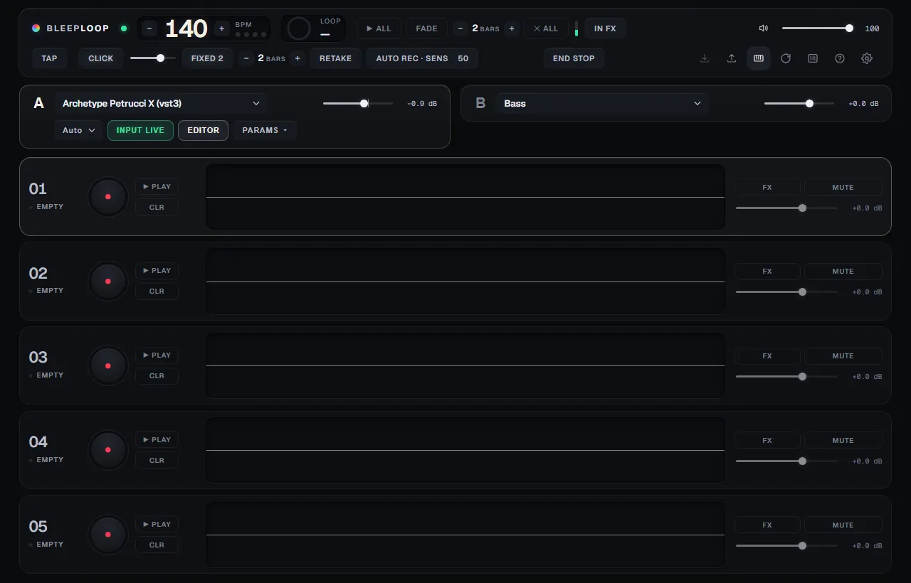
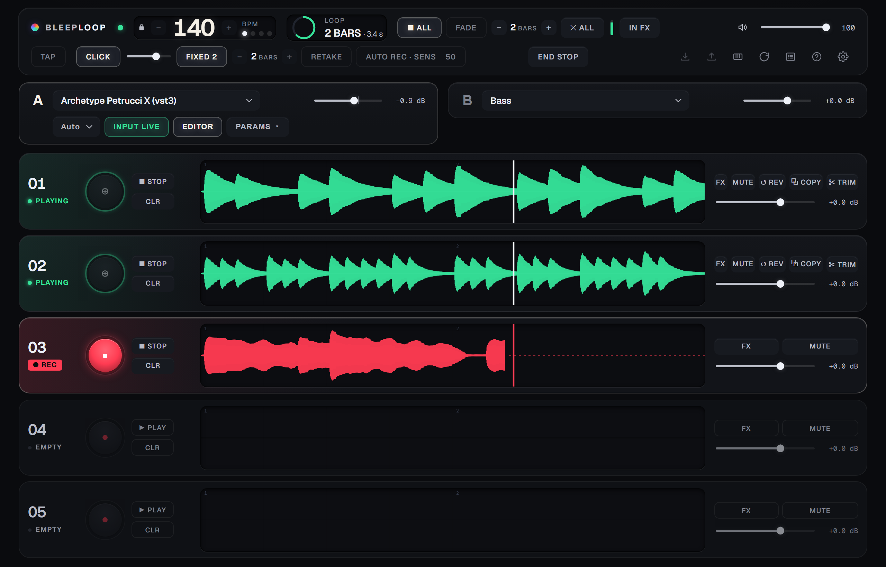

# BleepLoop

[](https://github.com/ikkeseb/bleeploop/actions/workflows/ci.yml)
[](LICENSE)
[](#play-it)

BleepLoop is a Windows looper you play with a guitar. Load your own amp-sim plugin (CLAP or VST3),
hear it through ASIO, and loop and overdub on five RC-505 MK II–style tracks. One native audio
engine runs the looper, click, synths, FX and your plugin inside the audio driver's callback, so
every take lands on the grid by itself: there is no latency setting.

[](https://github.com/ikkeseb/bleeploop/releases/latest)



## Highlights

- **Your amp sim, live.** Load your plugin, pick the guitar's input and press GO LIVE. The round trip
  is 8 ms at ASIO 64 and 15 ms at 128 on the developer's interface.
- **Takes land on the beat.** The engine places every take from the driver's reported latency, and
  the click is locked to the loop grid, so the click and the loops cannot drift apart.
- **Hands stay on the guitar.** Learn any looper control onto a MIDI footswitch. The stage view (B)
  shows the bar, the beat and every track, large enough to read from where you stand.
- **Nothing gets lost.** Your loops save as you play and come back when you reopen. Export a jam as
  one zip: a WAV stem per track, a mix and each plugin's settings.
- **More than guitar.** Six built-in synths, one of them a drum kit, and a MIDI keyboard fill the
  other layers.

The installed app tells you when a newer version is out and updates itself from Help.

<details>
<summary><b>Everything it does</b></summary>

- 5-track looper with overdub and one-level undo, per-track reverse, mute and volume, a one-bar
  record count-in and fixed-length record. The metronome is phase-locked to the loop grid, so the
  click and the loops cannot drift apart.
- AUTO REC arms the first track and starts its take when you start playing, instead of the count-in.
  Later tracks start on the loop grid either way.
- RETAKE keeps recording round the loop until you stop and keeps the last complete pass (the first
  track needs FIXED).
- END STOP makes STOP wait for the loop end; a second STOP press stops at once. FADE ends a song
  with a fade: every playing track fades out over 1, 2, 4 or 8 bars and stops on the bar line; the
  tracks keep their volumes, so PLAY ALL brings them back.
- DUB FEEDBACK (a track's FX drawer): how much of the layers under an overdub it keeps, pass by pass,
  so a loop can evolve instead of only piling up; 0 % replaces them.
- COPY duplicates a track, with its FX, volume and mute, into the first empty track.
- A later take shorter than the loop repeats (tiles) across it, so every track has the loop's exact
  length. Keep playing past the loop, or set FIXED longer than it, and the take grows the loop in whole
  loops instead (multiply), and the other tracks repeat across it. TRIM keeps a track's first bars and
  repeats them across the loop; undo brings the whole take back.
- Local recovery: committed loops are saved as you play and restored when you reopen, and closing
  the app with a jam in progress asks first.
- Per-track FX: filter, pitch shift, tempo-synced stutter, feedback delay and a shared reverb send.
  Each one bypasses without a click.
- IN FX: a tempo-synced echo, a reverb and a ring modulator on the live input, heard and recorded,
  while the dry signal and a take's timing stay untouched.
- Stage view (B, or a learned pedal): each track's state, the bar and the beat, and the count-in,
  large enough to read from where you stand with the guitar.
- Six built-in synths, one of them a 16-voice GM drum kit.
- Two native CLAP/VST3 plugin slots with floating plugin editors; each slot reloads its last plugin at
  launch with the settings you left it at, never armed, and an exported session carries each slot's
  settings.
- Guitar or line input monitored through your plugin inside the engine's callback: an 8 ms round
  trip at ASIO 64 and 15 ms at 128 on the developer's interface. Takes are placed from the driver's
  reported latency.
- Share output mirrors the master to a second output device, for OBS, a browser or a voice chat.
- MIDI controllers work through WebView2's native Web MIDI, and a MIDI footswitch, key or CC can be
  learned onto any looper control in Audio Settings: a track action on the selected track or a fixed
  one, tap tempo, the click, END STOP, FIXED, RETAKE, AUTO REC, FADE and the input effects, and HOLD to
  record while the pedal is down. Without one, the computer keyboard plays notes and
  runs the transport (1-5 or the arrow keys to select a track, Space to record, Enter to play and
  stop, Backspace to undo; Help lists every key).
- Session export and import as one `.zip`: a WAV stem per track, a wet stereo master render and a
  `session.json`.
- Help → About this build names the version and commit, copies a diagnostics block for a bug report
  and opens the log folder.

</details>

**What BleepLoop is not**

- Not a DAW: no timeline or arrangement. The mix is per-track volume, mute and FX.
- Not an amp sim: bring your own plugin.
- Not a low-latency MIDI host: MIDI arrives through WebView2's Web MIDI, a few milliseconds behind
  what a DAW would see.
- Not a web app: the browser build is a silent verification rig.
- Not cross-platform: Windows only.

## Play it

This is an early release. Get the installer from
[Releases](https://github.com/ikkeseb/bleeploop/releases/latest) and play through your interface's
ASIO® driver. WASAPI works as a fallback, but Windows and some drivers add latency they do not
report, so WASAPI takes can land late (about 215 ms on the developer's Focusrite).

1. Plug the guitar into your audio interface and start BleepLoop (the installed app, or
   `pnpm dev:asio` from source). In Audio Settings pick ASIO (and its driver, if you have more than
   one), the buffer size and the sample rate: 44.1 kHz, 48 kHz or the device's own. On WASAPI,
   Windows sets the rate.
2. Load your amp-sim plugin (CLAP or VST3) into a slot, pick the slot's input and press GO LIVE. For an
   instrument with its own sound, set the other slot to Off, pick its input and GO LIVE: it plays dry.
3. Select a track with 1–5 and press Space to record. The first take gets a one-bar count-in; come in on "1".
4. Space again closes the take; after that, Space overdubs the selected track and Enter plays or stops it.
5. Help (the ? in the command bar) lists the rest.



## Build from source

The frontend renders on its own in a browser with no native dependencies, silent: the sound, plugin
hosting and audio I/O are the native engine's, in the Tauri shell around it.

### Web frontend only

- Node >= 22.18, pnpm 10

```bash
git clone https://github.com/ikkeseb/bleeploop.git
cd bleeploop
pnpm install
pnpm dev          # http://localhost:1420, the UI only, silent
```

### Full native app

- Everything above, plus:
- Rust (pinned via `src-tauri/rust-toolchain.toml`), MSVC Build Tools 2022, WebView2

```bash
pnpm dev:wasapi                      # full app, WASAPI, no extra SDK needed
pnpm exec tauri build --no-bundle    # standalone WASAPI exe in src-tauri/target/release/app.exe
```

### ASIO low-latency tier (optional)

Set `LIBCLANG_PATH` (cpal's `asio-sys` runs bindgen) and point `CPAL_ASIO_DIR` at your own copy of
the Steinberg ASIO SDK. The SDK is not in this repo. A binary built with it is GPLv3, see
[Third-party notices](#license-and-third-party-notices).

```bash
pnpm dev:asio     # full app, ASIO + native sample rate
```

## Commands

| Command | What it does |
|---|---|
| `pnpm dev` | Vite dev server, frontend only (silent) |
| `pnpm dev:asio` | Full app, ASIO low-latency + native sample rate |
| `pnpm dev:wasapi` | Full app, WASAPI (no ASIO SDK needed) |
| `pnpm build` | `tsc --noEmit && vite build`, which the Tauri bundle depends on |
| `pnpm build:app` | Standalone release exe with ASIO (`tauri build --no-bundle --features asio`) |
| `pnpm check` | Typecheck, oxlint, the capability-boundary check, and the `verify/` guards. Also the pre-push hook |
| `pnpm verify` | Deterministic guards for the frontend's pure logic, file formats, the engine wire and the docs; no browser or hardware |
| `pnpm test:engine` | The engine's tests (`cargo test -p lf-engine`): looper, click, grid, synths and FX rendered offline, frame by frame |
| `pnpm probe <name>` | One browser probe against the real app on its own Vite server; `--ci` runs every CI probe, `--list` names them |
| `pnpm rust:check` | `cargo check` without and with ASIO, `cargo test`, then the check that keeps the engine crate free of host, device and plugin dependencies (Windows; the ASIO step needs the SDK) |
| `pnpm native:smoke` · `native:survey` · `native:swap` · `native:recall` | Launch the full app with a DEV plugin probe, print its verdict and stop (Windows, installed plugins) |

The `build-exe` workflow builds the ASIO installer and exe on a clean Windows runner and keeps them
as a run artifact for 30 days. Run it from the Actions tab. A `v*` tag also publishes the GitHub
Release with the installer, its sha256, the licence texts and the updater's manifest (latest.json) once the
build and its gates are green.
That binary is GPLv3, see the third-party notices.

## Architecture

One native audio engine, clocked by the audio device, owns the sound: looper, click, synths, FX,
limiter and the plugin slots run in the driver's callback (`src-tauri/crates/lf-engine`, the device
side in `src-tauri/src/engine_io`). The WebView is the UI: it sends commands and draws a state feed.
`src/platform/` is the only directory allowed to import `@tauri-apps/*`, and `pnpm check:boundary`
enforces that. The browser build renders the UI and is silent.

Full design decisions and invariants: [`docs/ARCHITECTURE.md`](docs/ARCHITECTURE.md).
Live project state and open threads: [`STATUS.md`](STATUS.md).

## Verification

There is no JS unit-test runner. Three layers:

- `cargo test -p lf-engine` (`pnpm test:engine`; CI runs it on every push that is not docs-only)
  renders the engine offline:
  every looper transition, the click and grid, a golden-jam port and property tests, bit-identical
  across block sizes, and the synths and FX null-tested against reference renders of the Tone code
  they replaced.
- `pnpm verify` (a few seconds, part of `pnpm check`) runs the frontend's real source in plain Node:
  pure modules, file formats and the engine wire.
- Browser probes (`pnpm probe`, in CI) drive the real UI in headless Chromium against a scripted
  engine fake: a gesture sends the right command, a feed frame shows the right screen; they also
  cover input ownership, session round trips and recovery. See [`verify/README.md`](verify/README.md).
  None of these reaches a real device, WebView2 or anything audible.

Feel, the native half and real rig latency are verified by running the app and measuring it, not by
reading code or trusting a typecheck. [`docs/VERIFY.md`](docs/VERIFY.md) explains how: the browser
harness, the `window.__lf` debug hook, audio measurement and the `tauri dev` routine on the PC.

## Thanks

To [@MARTINWOBBLE](https://github.com/MARTINWOBBLE), who has tested BleepLoop more than anyone and
keeps sending bug reports, feedback and ideas.

## License and third-party notices

The source is MIT, see [`LICENSE`](LICENSE). A binary built with `--features asio` links the
Steinberg ASIO SDK and is GPLv3 as a whole. [`THIRD-PARTY-NOTICES.md`](THIRD-PARTY-NOTICES.md)
lists the dependency licences, read from the installed packages and crates, and `licenses/` holds
the licence texts that ship with the installer.


ASIO is a registered trademark of Steinberg Media Technologies GmbH.
